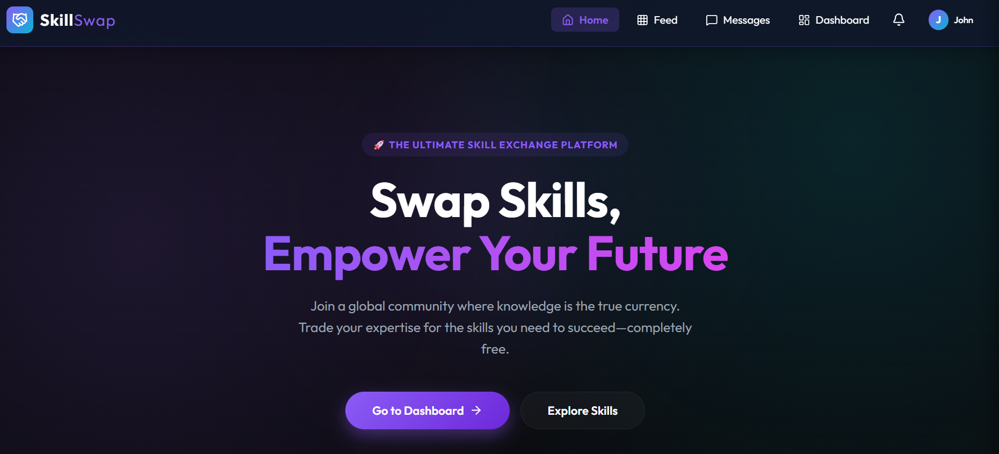
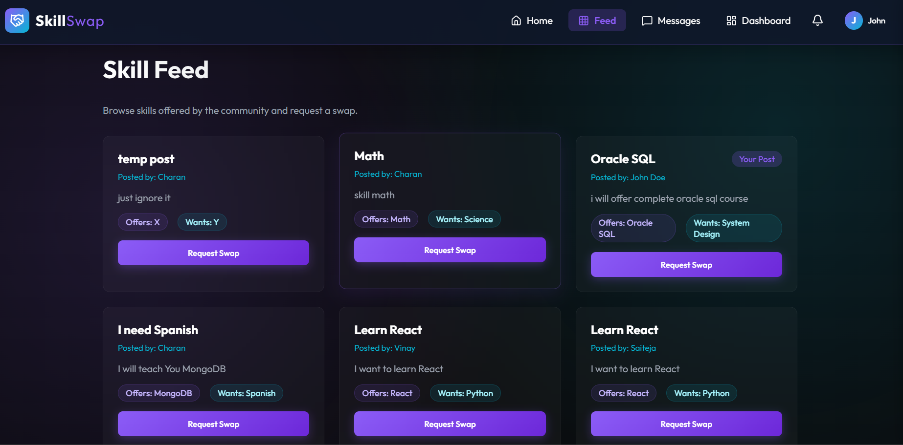
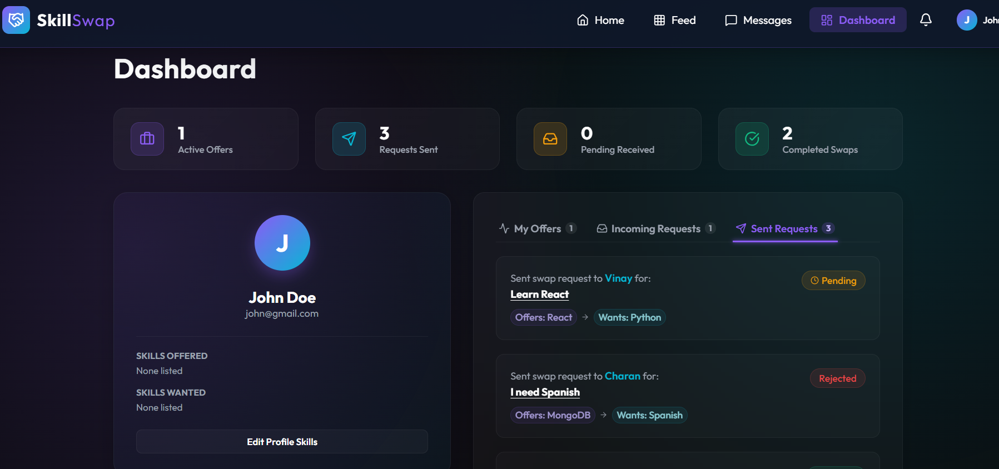
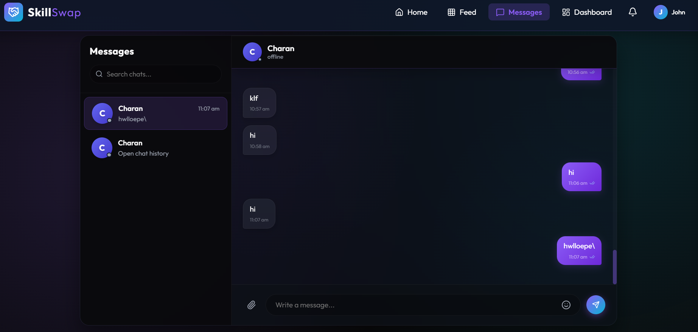

# SkillSwap Hub

SkillSwap Hub is a modern full-stack MERN application that enables users to exchange skills, connect with like-minded people, send collaboration requests, and communicate through a real-time messaging system powered by Socket.IO.

---

# Live Demo

Frontend: https://skill-swap-ten-fawn.vercel.app

Backend API: https://skillswap-zrev.onrender.com

---

# Features

## Authentication & Security
- User Registration & Login
- JWT-based Authentication
- Protected Routes
- Persistent Login Sessions
- Secure API Access
- Auth Middleware Protection

---

## Skill Feed System
- Create Skill Swap Posts
- Browse Community Skill Posts
- Skill Offered / Skill Wanted Structure
- Dynamic Feed Rendering
- Pagination with Load More
- Backend Search & Filtering Ready

---

## Request System
- Send Skill Collaboration Requests
- Request Status Management
- Accept / Reject Workflow
- Request Tracking Dashboard

---

# Real-Time Messaging System

## Socket.IO Powered Chat
- Real-Time Private Messaging
- Dynamic Conversations
- Live Message Delivery
- MongoDB Message Persistence
- Fetch Old Messages
- Optimistic UI Updates
- Online Users Tracking
- Conversation-Based Chat Architecture
- Auto Scroll Latest Messages
- Dynamic Conversation Sidebar

---

# Dashboard
- Personalized User Dashboard
- User Posts Management
- Requests Overview
- Quick Navigation Access

---

# UI / UX
- Modern Dark Theme
- Responsive Layout
- Minimal Chat Interface
- Dynamic Chat Bubbles
- Interactive Components
- Smooth Scrolling Experience

---

# Tech Stack

## Frontend
- React
- React Router DOM
- Axios
- Context API
- Socket.IO Client
- CSS3
- Vite

---

## Backend
- Node.js
- Express.js
- MongoDB Atlas
- Mongoose
- JWT Authentication
- Socket.IO
- CORS

---

# Deployment
- Frontend: Vercel
- Backend: Render
- Database: MongoDB Atlas

---

# Project Structure

```bash
SkillSwap/
│
├── client/
│   ├── src/
│   │   ├── components/
│   │   ├── context/
│   │   ├── pages/
│   │   ├── routes/
│   │   ├── services/
│   │   │   ├── api.js
│   │   │   └── socket.js
│   │   └── App.jsx
│   │
│   └── public/
│
├── server/
│   ├── src/
│   │   ├── config/
│   │   ├── controllers/
│   │   ├── middleware/
│   │   ├── models/
│   │   ├── routes/
│   │   ├── socket/
│   │   │   └── socket.js
│   │   ├── app.js
│   │   └── server.js
│
└── README.md
```

---

# Installation & Setup

## Clone Repository

```bash
git clone https://github.com/saiteja-bingi/SkillSwap.git
cd SkillSwap
```

---

# Backend Setup

```bash
cd server
npm install
```

Create `.env` file inside `server/`

```env
MONGO_URI=your_mongodb_uri
JWT_SECRET=your_secret_key
CLIENT_URL=http://localhost:5173
```

Run Backend

```bash
npm run dev
```

---

# Frontend Setup

```bash
cd client
npm install
```

Create `.env` file inside `client/`

```env
VITE_API_URL=http://localhost:5000/api
```

Run Frontend

```bash
npm run dev
```

---

# Socket.IO Architecture

## Connection Flow

```txt
Frontend User
↓
Socket Connection
↓
register_user event
↓
Backend maps:
onlineUsers[userId] = socket.id
↓
Private Messaging Enabled
```

---

## Real-Time Message Flow

```txt
Sender UI
↓
socket.emit("private_message")
↓
Backend Socket Server
↓
MongoDB Message Save
↓
Receiver Socket Detection
↓
io.to(socketId).emit("receive_message")
↓
Live UI Update
```

---

# API Endpoints

## Authentication

| Method | Endpoint | Description |
|--------|----------|-------------|
| POST | `/api/auth/register` | Register User |
| POST | `/api/auth/login` | Login User |
| GET | `/api/auth/profile` | Get User Profile |

---

## Posts

| Method | Endpoint | Description |
|--------|----------|-------------|
| GET | `/api/posts` | Get All Posts |
| POST | `/api/posts` | Create Post |
| PUT | `/api/posts/:id` | Update Post |
| DELETE | `/api/posts/:id` | Delete Post |

---

## Requests

| Method | Endpoint | Description |
|--------|----------|-------------|
| POST | `/api/requests/:postId` | Send Request |
| GET | `/api/requests` | Get Requests |

---

## Chat

| Method | Endpoint | Description |
|--------|----------|-------------|
| GET | `/api/chat/my-conversations` | Get User Conversations |
| GET | `/api/chat/messages/:conversationId` | Get Conversation Messages |
| POST | `/api/chat/:conversationId/message` | Send Message |

---

# Screenshots

## Home Page

Modern landing page with responsive design and skill-sharing workflow.

## Feed

Dynamic skill exchange feed with requests system and pagination.

## Dashboard

Centralized user dashboard for managing posts and requests.

## Real-Time Chat

Conversation-based live messaging system powered by Socket.IO.

---

# Future Improvements

- Typing Indicators
- Message Seen Status
- Push Notifications
- User Profile Editing
- Advanced Skill Search
- AI Skill Recommendations
- Group Conversations
- Media Sharing
- Voice & Video Calling
- Mobile App Version

---

# Learning Outcomes

This project helped in understanding:

- Full-Stack MERN Architecture
- REST API Development
- JWT Authentication
- Protected Routes
- MongoDB Data Modeling
- Socket.IO Real-Time Communication
- Persistent vs Runtime State
- Dynamic Conversation Architecture
- React State-Driven UI
- Optimistic UI Updates
- Deployment Workflow
- Scalable Frontend & Backend Structure

---

# Author

Sai Teja

B.Tech CSE (AI & ML)

Passionate about Full-Stack Development, Real-Time Systems, AI, and Scalable Web Applications.

---

# License

This project is built for learning, development, and portfolio purposes.